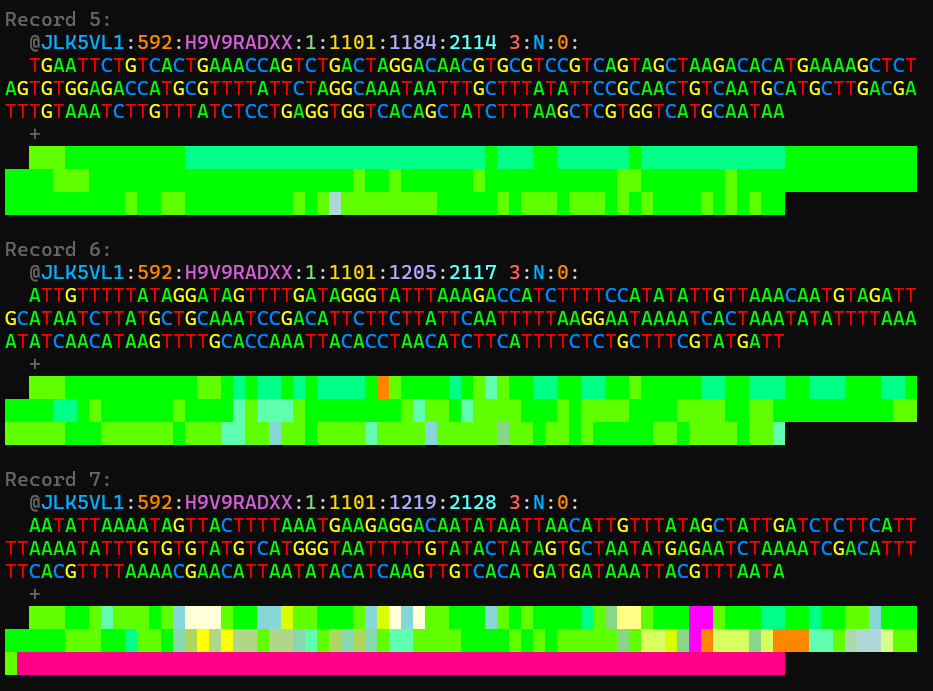

# fqview
A lightweight python fastq file visualizer. Works with gzipped files, or any fastq file

The quality visualization maps a Phred quality score (0-41+ | ascii "!" to "I") to a color for easy viewing. Anything above ascii "I" is displayed equivalently

See the table at https://en.wikipedia.org/wiki/FASTQ_format#Encoding for more detail

# Instructions
python fqview.py \<path_to_fastq_file\>

# Optional Arguments
-n \<number of records to display\>

--no-seq-color  : turns off nucleotide coloring

--legend        : shows a legend at the top for quality scores

--raw-quality   : show quality characters underneath normal colored quality display

--wrap \<max line length\>
